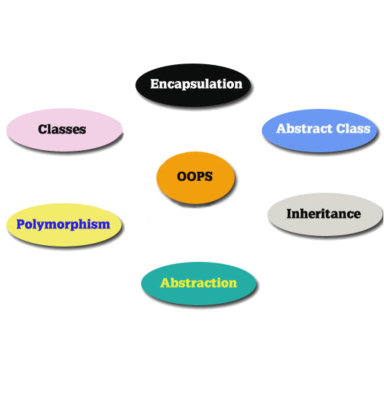
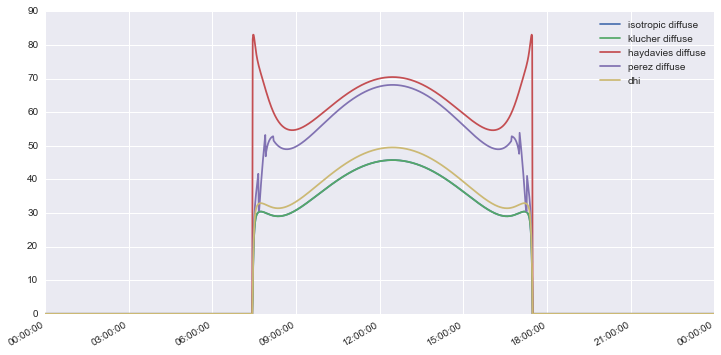
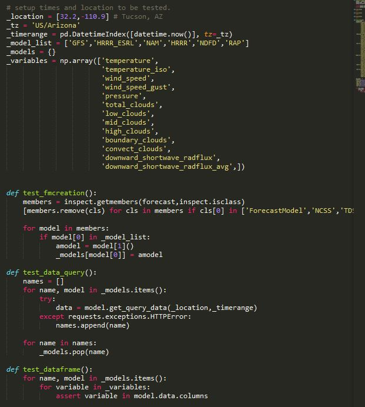

.. _forecast_module:

****************************
Forecast Module Background
****************************

This document is under construction.

Here is the background behind the development of the forecast module.

PV System Power Calculation with pvlib-python
~~~~~~~~~~~~~~~~~~~~~~~~~~~~~~~~~~~~~~~~~~~~~

Here is the process that is used to produce a power output estimate using pvlib library.

.. image:: images/pvlib.png

Forecasted Meteorological Data
~~~~~~~~~~~~~~~~~~~~~~~~~~~~~~

 Listed in the chart below are the forecast models and their intervals for which data is available on the
 Unidata THREDDS server.

.. image:: images/unidata.jpg
.. image:: images/thredds_icon.jpg
.. image:: images/thredds_data.jpg

Unidata THREDDS Data Server (TDS)
~~~~~~~~~~~~~~~~~~~~~~~~~~~~~~~~~

Where does the data come from?

Unidata hosts a THREDDS Data Server that contains the forecast model data from NCAR, NCEP, and FNMOC.

Thematic Real-time Environmental Distributed Data Services (THREDDS)

* http://thredds.ucar.edu
* http://thredds.ucar.edu/thredds/catalog.html
* XML based online data repository
* Multiple data formats supported (netCDF, HDF5, GRIB, NEXRAD, OPeNDAP, etc.)

Unidata Siphon
~~~~~~~~~~~~~~

What is Siphon?

Open source Python library for downloading data from Unidata technologies THREDDS Data Server (TDS).
https://github.com/Unidata/siphon

How to download the data?
Using the NCSS (netCDF subset service) module which accesses the xml catalogs on the TDS.

What versions of Python are supported?
Python 2.7 & Python >= 3.3

Available via pypi, Binstar, and Github

pvlib-python Forecast Module Objectives
~~~~~~~~~~~~~~~~~~~~~~~~~~~~~~~~~~~~~~~

The criteria for the module development were as follows (many were focused around object-oriented programming).

* Simple and easy to use
* Comprehensive
* Flexible
* Integrated
* Standardized

Challenges
~~~~~~~~~~
There were several challenges that were addressed when putting together the forecast module.

* Data format dissimilarities between forecast models
	* Forecast period
		Many of the forecasts come at different intervals and span different lengths of time.
	* Variables provided
		The model share many of the same quantities, however they are labeled using different terms 
		or need to be converted into useful values.
	* Data availability
		The models are updated a different intervals and also are sometimes missing data.
	
* Irradiance
	* Cloud cover and radiation
		Many of the forecast models do not have radiation observations or if they 
		do they are incorrect. Since it is necessary to have accurate radiation values
		to calculate power output the model by default uses a basic radiation function 
		(Liu and Jordan, 1960) to generate more appropriate radiation values based on cloud cover.

.. math::

	DNI &= {\tau} ^m DNI_{extraterrestrial} \\
	DHI &= 0.3(1 - {\tau} ^m)cos{\psi}DNI_{extraterrestrial}
	
Liu, B. Y., R. C. Jordan, (1960). "The interrelationship and
characteristic distribution of direct, diffuse, and total solar
radiation".  Solar Energy 4:1-19

Forecast Module Structure
~~~~~~~~~~~~~~~~~~~~~~~~~

Hosted on GitHub
https://github.com/MoonRaker/pvlib-python

Existing functionality
	* location
	* Air mass number (atmosphere.py)
	* Direct Radiation (clearsky.py)
	* POA diffuse radiation (irradiance.py)
	* Solar angles (solarposition.py)
	* Conversion to power (pvsystem.py)

Added functionality
	* Unidata Forecast data (forecast.py)
	* Cloud cover to diffuse radiation (irradiance.py)

Model subclass
~~~~~~~~~~~~~~

Each forecast model has its own subclass. These subclasses belong to a more comprehensive parent
class that holds many of the methods used by every model. 

Within each subclass model specific variables are assigned to common variable labels that are 
available from each forecast model.

Here are the subclasses for two models.

.. image:: images/gfs.jpg
.. image:: images/ndfd.jpg

ForecastModel class
~~~~~~~~~~~~~~~~~~~

The following code is part of the parent class that each forecast model belongs to.

.. image:: images/forecastmodel.jpg

Upon instatiation of a forecast model, several assignments are made and functions called to inintialize 
values and objects within the class.

.. image:: images/fm_init.jpg

The query function is responsible for completing the retrival of data from the Unidata THREDDS server using
the Unidata siphon THREDDS server API.

.. image:: images/query.jpg

The ForecastModel class also contains miscellaneous functions that process raw netcdf data from the THREDDS
server and create containers for all the processed data.

.. image:: images/tempconvert.jpg

Tests
~~~~~

The nose library is used to perform tests on the library modules to ensure that the library performs as 
expected and as it was intended.

