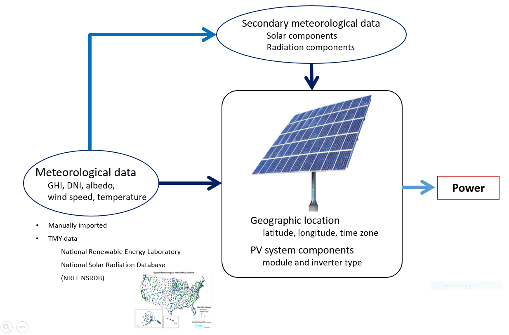
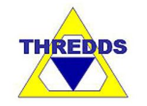
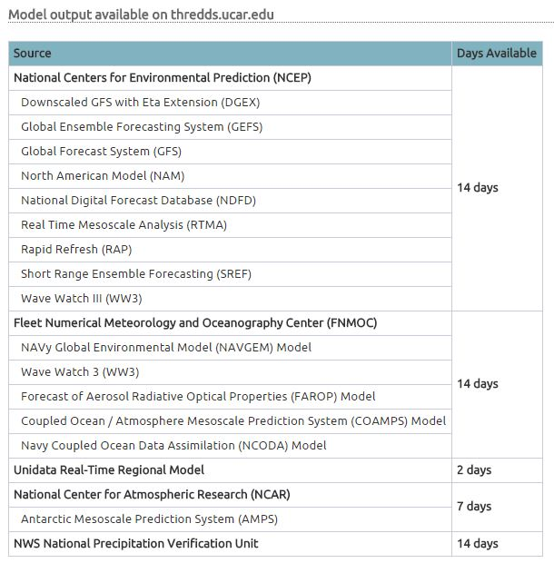
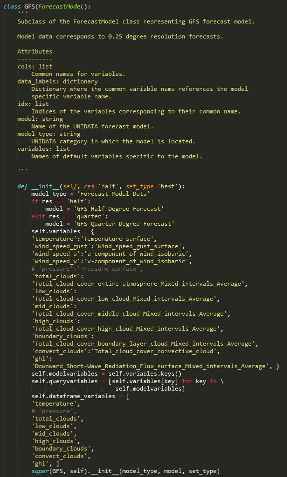
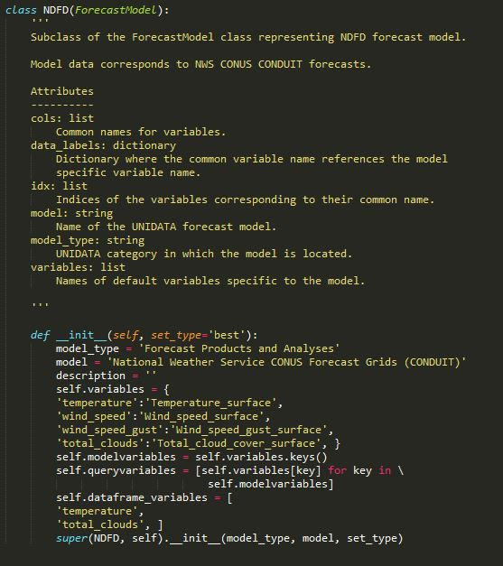
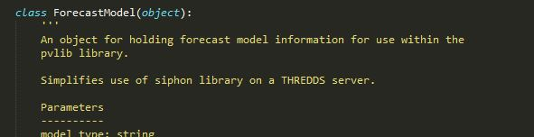
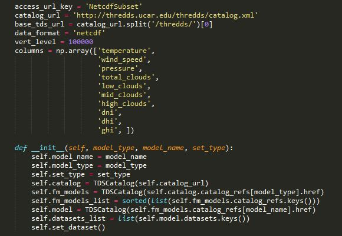
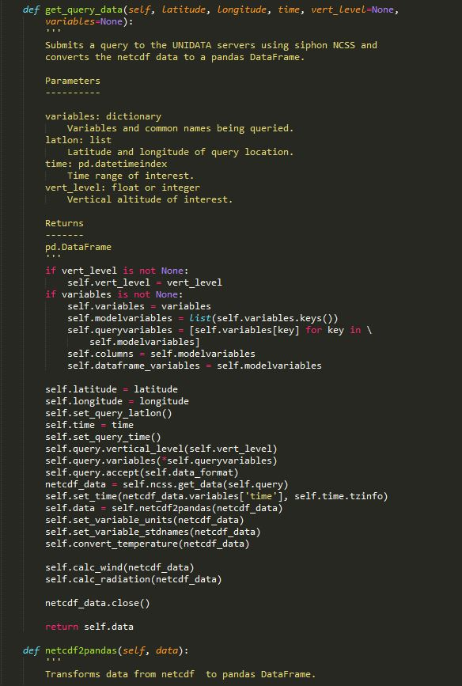
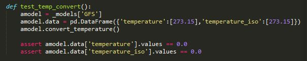

.. _forecasts:

*****************************
Forecasting with pvlib-python
*****************************

pvlib-python provides a forecast module that makes it easy to obtain
data from the Unidata THREDDS server and turn that data into PV power
forecasts. pvlib-python uses the Unidata's Siphon library to simplify
access to the forecast data.

PV System Power Calculation with pvlib-python
~~~~~~~~~~~~~~~~~~~~~~~~~~~~~~~~~~~~~~~~~~~~~

Here is the process that is used to produce a power output
estimate using the pvlib library.

Forecast Data from Unidata
~~~~~~~~~~~~~~~~~~~~~~~~~~

Listed in the chart below are the forecast models and their
intervals for which data is available on the
Unidata THREDDS server as of December, 2015.

The Unidata THREDDS Data Server contains forecast
model data from NCAR, NCEP, and FNMOC.

More information can be found at

* http://thredds.ucar.edu
* http://thredds.ucar.edu/thredds/catalog.html

Siphon
~~~~~~

Siphon is an open source Python library for retrieving data
from Unidata's THREDDS server. pvlib-python makes use of Siphon's
and THREDDS NetCDF Subset Service (NCSS).

pvlib-python Forecast Module Overview
~~~~~~~~~~~~~~~~~~~~~~~~~~~~~~~~~~~~~

Forecasts in pvlib-python aim to be:

* Simple and easy to use
* Comprehensive
* Flexible
* Integrated
* Standardized

There were several challenges that were addressed when putting together the forecast module.

* Data format dissimilarities between forecast models
	* Forecast period
		Many of the forecasts come at different intervals
		and span different lengths of time.
	* Variables provided
		The model share many of the same quantities,
		however they are labeled using different terms
		or need to be converted into useful values.
	* Data availability
		The models are updated a different intervals and
		also are sometimes missing data.

* Irradiance
	* Cloud cover and radiation
		Many of the forecast models do not have radiation
		fields, or if they do they suffer from poor solar
		position calculations or radiative transfer algorithms.
		It is often more accurate to create empirically derived
		radiation forecasts from the weather models' cloud cover
		forecasts. pvlib-python currently uses the Liu Jordan model
		to convert cloud cover to radiation, however, we encourage
		developers to explore alternatives.

.. math::

	DNI &= {\tau} ^m DNI_{ET} \\
	DHI &= 0.3(1 - {\tau} ^m)cos{\psi}DNI_{ET}

Liu, B. Y., R. C. Jordan, (1960). "The interrelationship and
characteristic distribution of direct, diffuse, and total solar
radiation".  Solar Energy 4:1-19

Forecast Module Structure
~~~~~~~~~~~~~~~~~~~~~~~~~

Model subclass
~~~~~~~~~~~~~~

Each forecast model has its own subclass.
These subclasses belong to a more comprehensive parent
class that holds many of the methods used by every model.

Within each subclass model specific variables are
assigned to common variable labels that are
available from each forecast model.

Here are the subclasses for two models.

ForecastModel class
~~~~~~~~~~~~~~~~~~~

The following code is part of the parent class that
each forecast model belongs to.

Upon instatiation of a forecast model, several assignments are
made and functions called to initialize
values and objects within the class.

The query function is responsible for completing the retrieval
of data from the Unidata THREDDS server using
the Unidata siphon THREDDS server API.

The ForecastModel class also contains miscellaneous functions
that process raw NetCDF data from the THREDDS
server and create a DataFrame for all the processed data.

