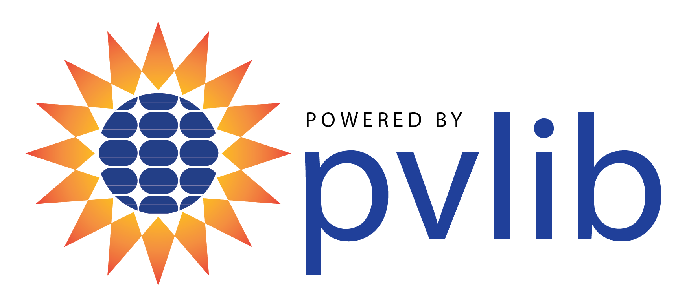
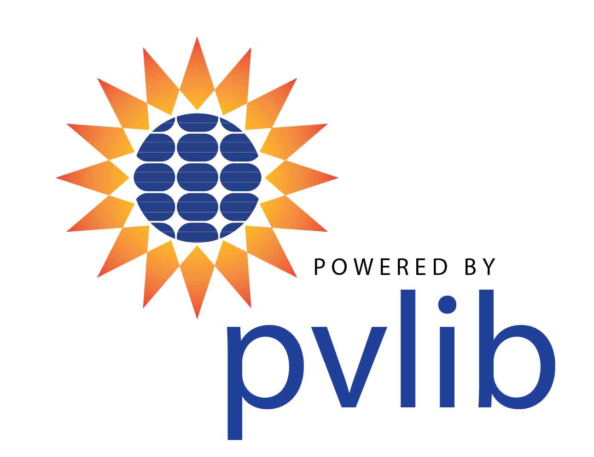

.. image:: _images/pvlib_logo_horiz.png
  :width: 600

pvlib python
============

pvlib python is a community developed toolbox that provides a set of
functions and classes for simulating the performance of photovoltaic
energy systems and accomplishing related tasks.
The core mission of pvlib python is to provide open,
reliable, interoperable, and benchmark implementations of PV system models.

The source code for pvlib python is hosted on `GitHub
<https://github.com/pvlib/pvlib-python>`_.
Please see the :ref:`installation` page for installation help.

For examples of how to use pvlib python, please see
:ref:`package_overview` and the :ref:`example_gallery`.
The documentation assumes general familiarity with
Python, NumPy, and Pandas. Google searches will yield many
excellent tutorials for these packages.

The pvlib python GitHub wiki has a `Projects and publications that use
pvlib python
<https://github.com/pvlib/pvlib-python/wiki/Projects-and-publications-
that-use-pvlib-python>`_ page for inspiration and listing of your
application.

There is a :ref:`variable naming convention <nomenclature>` to
ensure consistency throughout the library.

History and acknowledgement
===========================

pvlib python began in 2013 as a Python translation of the `PVLIB for Matlab <https://github.com/sandialabs/MATLAB_PV_LIB>`_
toolbox developed by Sandia National Laboratories. pvlib python has grown substantially since then.
Today it contains code contributions from over a hundred individuals worldwide
and is maintained by a core group of PV modelers from a variety of institutions.

pvlib has been supported directly and indirectly by DOE, NumFOCUS, and
Google Summer of Code funding, university research projects,
companies that allow their employees to contribute, and from personal time.

Citing pvlib python
===================

Many of the contributors to pvlib python work in institutions where
citation metrics are used in performance or career evaluations. If you
use pvlib python in a published work, please cite:

**Recommended citation for the pvlib python project**

  Anderson, K., Hansen, C., Holmgren, W., Jensen, A., Mikofski, M., and Driesse, A.
  "pvlib python: 2023 project update."
  Journal of Open Source Software, 8(92), 5994, (2023).
  :doi:`10.21105/joss.05994`.

**Recommended citation for pvlib iotools**

  Jensen, A., Anderson, K., Holmgren, W., Mikofski, M., Hansen, C., Boeman, L., Loonen, R.
  "pvlib iotools — Open-source Python functions for seamless access to solar irradiance data."
  Solar Energy, 266, 112092, (2023).
  :doi:`10.1016/j.solener.2023.112092`.

**Historical citation for pvlib python**

  Holmgren, W., Hansen, C., and Mikofski, M.
  "pvlib python: a python package for modeling solar energy systems."
  Journal of Open Source Software, 3(29), 884, (2018).
  :doi:`10.21105/joss.00884`.

**Version specific citation**
Please also cite the DOI corresponding to the specific version of
pvlib python that you used. pvlib python DOIs are listed at
`Zenodo.org <https://zenodo.org/search?page=1&size=20&q=conceptrecid:593284&all_versions&sort=-version>`_

Additional pvlib python publications include:

* J. S. Stein, "The Photovoltaic Performance Modeling Collaborative (PVPMC),"
  2012 38th IEEE Photovoltaic Specialists Conference (PVSC),
  Austin, TX, USA, 2012, pp. 003048-003052, :doi:`10.1109/PVSC.2012.6318225`.
* R. W. Andrews, J. S. Stein, C. Hansen and D. Riley, "Introduction to the open
  source PV LIB for python Photovoltaic system modelling package," 
  2014 IEEE 40th Photovoltaic Specialist Conference (PVSC),
  Denver, CO, USA, 2014, pp. 0170-0174, :doi:`10.1109/PVSC.2014.6925501`.
  (`paper
  <https://www.osti.gov/servlets/purl/1241774>`__)
* W.F. Holmgren, R.W. Andrews, A.T. Lorenzo, and J.S. Stein, "PVLIB Python 2015,"
  2015 IEEE 42nd Photovoltaic Specialist Conference (PVSC),
  New Orleans, LA, USA, 2015, pp. 1-5, :doi:`10.1109/PVSC.2015.7356005`.
  (`paper
  <https://github.com/pvlib/pvsc2015/blob/main/pvlib_pvsc_42.pdf>`__ and
  the `notebook to reproduce the figures
  <http://nbviewer.org/github/pvlib/pvsc2015/blob/main/paper.ipynb>`_)
* J.S. Stein, W.F. Holmgren, J. Forbess, and C.W. Hansen,
  "PVLIB: Open Source Photovoltaic Performance Modeling Functions for Matlab and Python,"
  2016 IEEE 43rd Photovoltaic Specialists Conference (PVSC),
  Portland, OR, USA, 2016, pp. 3425-3430, :doi:`10.1109/PVSC.2016.7750303`.
* W.F. Holmgren and D.G. Groenendyk,
  "An Open Source Solar Power Forecasting Tool Using PVLIB-Python,"
  2016 IEEE 43rd Photovoltaic Specialists Conference (PVSC),
  Portland, OR, USA, 2016, pp. 0972-0975, :doi:`10.1109/PVSC.2016.7749755`.

Logo
====
If you use pvlib python in a commercial or publicly-available
application, please consider displaying one of the "powered by pvlib"
logos:

License
=======

`BSD 3-clause <https://github.com/pvlib/pvlib-python/blob/main/LICENSE>`_.

NumFOCUS
========

pvlib python is a `NumFOCUS Affiliated Project <https://numfocus.org/sponsored-projects/affiliated-projects>`_

.. image:: https://i0.wp.com/numfocus.org/wp-content/uploads/2019/06/AffiliatedProject.png
  :target: https://numfocus.org/sponsored-projects/affiliated-projects
  :alt: NumFocus Affliated Projects

.. toctree::
   :maxdepth: 1
   :hidden:

   user_guide/index
   gallery/index
   reference/index
   whatsnew
   contributing/index
