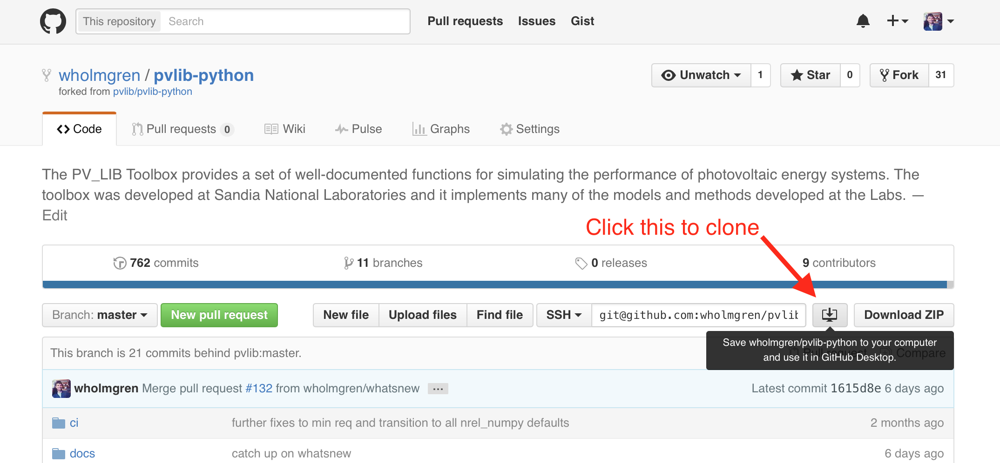

.. _installation:

Installation
============

Installing pvlib-python ranges from trivial to difficult depending
on your python experience, how you want to use pvlib, and your
system configuration.

**Do you already have Python and the NumPy and Pandas libraries?**

    If the answer to this is *No*, follow the :ref:`nopython` instructions
    to obtain the Anaconda Python distribution before proceeding.

**Do you want to use the pvlib-python as-is, or do you want to be
able to edit the source code?**

    If you want to use pvlib-python *as-is*, follow the simple
    :ref:`standardrelease` instructions.

    If you want to be able to *edit the source code*, follow the
    :ref:`editablelibrary` instructions.

Installing pvlib-python is similar to installing most scientific python
packages, so see the :ref:`references` section for further help.

Please see the :ref:`compatibility` section for information on the
optional packages that are needed for some pvlib-python features.

.. _nopython:

If you don't have Python
------------------------

There are many ways to install Python on your system, but the Anaconda
Python distribution is the easiest way for most new users to get
started. Anaconda includes all of the popular libraries that you'll need
for pvlib, including Pandas, NumPy, and SciPy.

#. **Install** the Anaconda Python distribution available at
   `Anaconda.com <https://www.anaconda.com/download/>`_.

See `What is Anaconda? <https://www.anaconda.com/what-is-anaconda/>`_
and the `Anaconda Documentation <https://docs.anaconda.com/anaconda/>`_
for more information.

You can now install pvlib-python by one of the methods below.

.. _standardrelease:

Install standard release
------------------------

Users may install pvlib-python using either the
`conda <https://conda.io/docs/>`_ or `pip <https://pip.pypa.io>`_
package manager. We recommend that most users install pvlib-python
using the conda package manager in the
`Anaconda Python distribution <https://www.anaconda.com/what-is-anaconda/>`_.
To install the most recent stable release of pvlib-python in a
non-editable way, use one of the following commands to install pvlib-python::

    # get the package from the pvlib conda channel
    # best option for installing pvlib in the base Anaconda distribution
    conda install -c pvlib pvlib

    # get the package from the conda-forge conda channel
    # best option if using pvlib.forecast module
    # strongly recommend installing in a separate conda env as shown below
    conda create -n pvlib -c conda-forge pvlib-python; conda activate pvlib

    # get the package from the Python Package Index
    # best option if you know what you are doing
    pip install pvlib

    # get pvlib and optional dependencies from the Python Package Index
    # another option if you know what you are doing
    pip install pvlib[optional]

.. note::

    By default, pvlib will not install some infrequently used dependencies.
    If you run into an error such as
    `ModuleNotFoundError: No module named 'netCDF4'`
    you can either install pvlib with all optional dependencies using
    `pip install pvlib[optional]`, or you can install pvlib from conda-forge
    `conda create -n pvlib -c conda-forge pvlib-python; conda activate pvlib`.

If your system complains that you don't have access privileges or asks
for a password then you're probably trying to install pvlib into your
system's Python distribution. This is usually a bad idea and you should
follow the :ref:`nopython` instructions before installing pvlib.

You may still want to download the Python source code so that you can
easily get all of the Jupyter Notebook tutorials. Either clone the `git
repository <https://github.com/pvlib/pvlib-python>`_ or go to the
`Releases page <https://github.com/pvlib/pvlib-python/releases>`_ to
download the zip file of the most recent release. You can also use the
nbviewer website to choose a tutorial to experiment with. Go to our
`nbviewer tutorial page
<http://nbviewer.jupyter.org/github/pvlib/pvlib-python/tree/master/docs/
tutorials/>`_.

.. _editablelibrary:

Install as an editable library
------------------------------

Installing pvlib-python as an editable library involves 3 steps:

1. :ref:`obtainsource`
2. :ref:`setupenvironment`
3. :ref:`installsource`

None of these steps are particularly challenging, but they become
more difficult when combined.
With a little bit of practice the process will be fast and easy.
Experienced users can easily execute these steps in less than a minute.
You'll get there.

.. _obtainsource:

Obtain the source code
~~~~~~~~~~~~~~~~~~~~~~

We will briefly describe how to obtain the pvlib-python source code
using the git/GitHub version control system. We strongly encourage users
to learn how to use these powerful tools (see the :ref:`references`!),
but we also recognize that they can be a substantial roadblock to
getting started with pvlib-python. Therefore, you should know that you
can download a zip file of the most recent development version of the
source code by clicking on the **Download Zip** button on the right side
of our `GitHub page <https://github.com/pvlib/pvlib-python>`_ or
download a zip file of any stable release from our `Releases page
<https://github.com/pvlib/pvlib-python/releases>`_.

Follow these steps to obtain the library using git/GitHub:

#. **Download** the `GitHub Desktop <https://desktop.github.com>`_ application.
#. **Fork** the pvlib-python project by clicking on the "Fork" button on
   the upper right corner of the
   `pvlib-python GitHub page <https://github.com/pvlib/pvlib-python>`_.
#. **Clone** your fork to your computer using the GitHub Desktop application
   by clicking on the *Clone to Desktop* button on your fork's homepage.
   This button is circled in the image below. Remember the system path that
   you clone the library to.

Please see GitHub's
`Forking Projects <https://guides.github.com/activities/forking/>`_,
`Fork A Repo <https://help.github.com/articles/fork-a-repo/>`_,
and the `git-scm <https://git-scm.com/documentation>`_ for
more details.

.. _setupenvironment:

Set up a virtual environment
~~~~~~~~~~~~~~~~~~~~~~~~~~~~

We strongly recommend working in a `virtual environment
<http://astropy.readthedocs.org/en/latest/development/workflow/
virtual_pythons.html>`_ if you're going to use an editable version
of the library. You can skip this step if:

#. You already have Anaconda or another scientific Python distribution
#. You don't mind polluting your Python installation with your
   development version of pvlib.
#. You don't want to work with multiple versions of pvlib.

There are many ways to use virtual environments in Python,
but Anaconda again provides the easiest solution. These are often
referred to as *conda environments*, but they're the same for our purposes.

#. **Create** a new conda environment for pvlib and pre-install
   the required packages into the environment:
   ``conda create --name pvlibdev python pandas scipy``
#. **Activate** the new conda environment: ``conda activate pvlibdev``
#. **Install** additional packages into your development environment:
   ``conda install jupyter ipython matplotlib pytest nose flake8``

The `conda documentation <https://conda.io/docs/index.html>`_ has more
information on how to use conda virtual environments. You can also add
``-h`` to most pip and conda commands to get help (e.g. ``conda -h`` or
``conda env -h``)

.. _installsource:

Install the source code
~~~~~~~~~~~~~~~~~~~~~~~

Good news -- installing the source code is the easiest part!
With your conda/virtual environment still active...

#. **Install** pvlib-python in "development mode" by running
   ``pip install -e .`` from within the directory you previously cloned.
   Consider installing pvlib using ``pip install -e .[all]`` so that
   you can run the unit tests and build the documentation.
   Your clone directory is probably similar to
   ``C:\Users\%USER%\Documents\GitHub\pvlib-python``(Windows) or
   ``/Users/%USER%/Documents/pvlib-python`` (Mac).
#. **Test** your installation by running ``python -c 'import pvlib'``.
   You're good to go if it returns without an exception.

The version of pvlib-python that is on that path is now available
as an installed package inside your conda/virtual environment.

Any changes that you make to this pvlib-python will be available inside
your environment. If you run a git checkout, branch, or pull command the
result will be applied to your pvlib-python installation. This
is great for development. Note, however, that you will need to use
Python's ``reload`` function (`python 3
<https://docs.python.org/3/library/importlib.html#importlib.reload>`_)
if you make changes to pvlib during an interactive Python
session (including a Jupyter notebook). Restarting the Python
interpreter will also work.

Remember to ``conda activate pvlibdev`` (or whatever you named your
environment) when you start a new shell or terminal.

.. _compatibility:

Compatibility
-------------

pvlib-python is compatible with Python 3.

pvlib-python requires Pandas, Numpy, and SciPy. The minimum version requirements
are specified in
`setup.py <https://github.com/pvlib/pvlib-python/blob/master/setup.py>`_.
They are typically releases from several years ago.

A handful of pvlib-python features require additional packages that must
be installed separately using pip or conda. These packages/features
include:

* pytables (tables on PyPI): Linke turbidity look up for clear sky models
* statsmodels: parameter fitting
* numba: fastest solar position calculations
* pyephem: solar positions calculations using an astronomical library
* siphon: forecasting PV power using the pvlib.forecast module

The Anaconda distribution includes most of the above packages.

Alternatively, users may install all optional dependencies using

    pip install pvlib[optional]

.. _nrelspa:

NREL SPA algorithm
------------------

pvlib-python is distributed with several validated, high-precision, and
high-performance solar position calculators. We strongly recommend using
the built-in solar position calculators.

pvlib-python also includes unsupported wrappers for the official NREL
SPA algorithm. NREL's license does not allow redistribution of the
source code, so you must jump through some hoops to use it with pvlib.
You will need a C compiler to use this code.

To install the NREL SPA algorithm for use with pvlib:

#. Download the pvlib repository (as described in :ref:`obtainsource`)
#. Download the `SPA files from NREL <http://www.nrel.gov/midc/spa/>`_
#. Copy the SPA files into ``pvlib-python/pvlib/spa_c_files``
#. From the ``pvlib-python`` directory, run ``pip uninstall pvlib``
   followed by ``pip install .``

.. _references:

References
----------

Here are a few recommended references for installing Python packages:

* `The Pandas installation page
  <http://pandas.pydata.org/pandas-docs/stable/install.html>`_
* `python4astronomers Modules, Packages, and all that
  <https://python4astronomers.github.io/installation/packages.html>`_
* `Python Packaging User Guide
  <http://python-packaging-user-guide.readthedocs.org/en/latest/>`_
* `Conda User Guide
  <http://conda.pydata.org/docs/index.html>`_

Here are a few recommended references for git and GitHub:

* `The git documentation <https://git-scm.com/doc>`_:
  detailed explanations, videos, more links, and cheat sheets. Go here first!
* `Forking Projects <https://guides.github.com/activities/forking/>`_
* `Fork A Repo <https://help.github.com/articles/fork-a-repo/>`_
* `Cloning a repository
  <https://help.github.com/articles/cloning-a-repository/>`_
* `Aha! Moments When Learning Git
  <http://betterexplained.com/articles/aha-moments-when-learning-git/>`_

